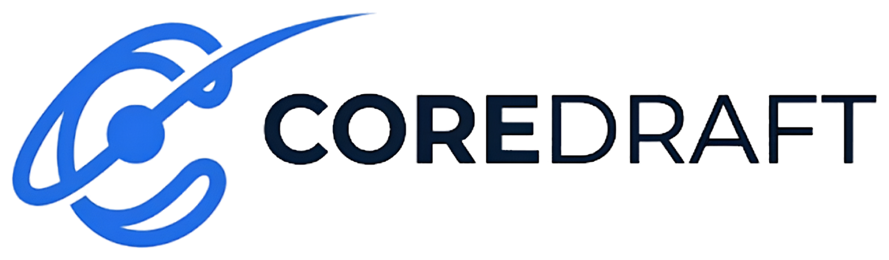

<p align="center">
  <picture>
    <source media="(prefers-color-scheme: dark)" srcset="assets/coredraft_logo_dark.png">
    
  </picture>
</p>

# coredraft

A minimal, distraction-free drawing canvas for quick sketches, diagrams, and mind maps. Runs entirely in the browser — no installation, no backend, no build step.

> Note: fonts are loaded from Google Fonts (with graceful fallback to system fonts when offline); everything else is fully local.

## Features

- **Drawing tools** — pen, eraser, text, shapes (arrow, line, rectangle, circle)
- **Select & move** — click any object to select it, drag or nudge it with the arrow keys, delete it
- **Geometric eraser** — erases the exact geometry under the cursor instead of painting over it, so partly
  erased strokes and shapes keep their gaps when you move them later
- **Velocity-sensitive pen** — strokes taper as you draw faster
- **Smart stroke refinement** — two opt-in Draw-tool modes that clean up each stroke as you lift the pen.
  Both leave you with an ordinary stroke, so it still erases and moves like one:
  - **Smart Stroke** (`S`) — snaps a closed stroke to a perfect circle, rectangle or triangle, and smooths
    everything else to remove hand jitter
  - **Smart Stroke 2** (`Shift+S`) — rebuilds any stroke, open or closed, out of exact pieces: straight runs
    become dead-straight lines (pulled onto a 45° step when they are already within 7° of one), curved runs
    become true arcs, and corners stay sharp. Built for letterforms and everyday boxes and arrows
- **Rich text** — 7 fonts, adjustable size, bold / italic; double-click any text to edit it in place
- **Infinite canvas** — pan and zoom freely (4%–1000%), with pinch-zoom and touch drawing on tablets
- **Dark / Light mode**
- **Undo / Redo** with full history
- **Auto-save** — the whole canvas (objects, viewport, theme, name) is stored in IndexedDB and restored
  automatically after a refresh, tab close, or crash
- **Canvas info card** — name your canvas and see when you started it
- **Paste images** directly from clipboard (Ctrl+V)
- **Export** to PNG or PDF
- **Keyboard shortcuts** for fast workflow

## Usage

Just open `index.html` in any modern browser. That's it.

Run the unit tests (zero dependencies, Node only):

```sh
node tests/geometry.test.js
```

| Shortcut | Action |
|---|---|
| `V` / `D` / `E` / `T` / `P` | Select / Draw / Eraser / Text / Pan |
| `A` / `L` / `R` / `C` | Arrow / Line / Rectangle / Circle |
| `S` / `Shift+S` (draw tool) | Toggle Smart Stroke / Smart Stroke 2 (one at a time) |
| `Space` + drag, or middle-mouse drag | Pan canvas |
| Scroll, or pinch | Zoom in/out |
| `Ctrl+Z` / `Ctrl+Y` (or `Ctrl+Shift+Z`) | Undo / Redo |
| `Ctrl+V` | Paste image |
| Double-click text | Edit it in place |
| `←` `→` `↑` `↓` (select tool) | Nudge selection by 1px — hold `Shift` for 10px |
| `Delete` / `Backspace` (select tool) | Delete selection |
| `Esc` | Finish text editing / close menus |

## License

[MIT](LICENSE)
